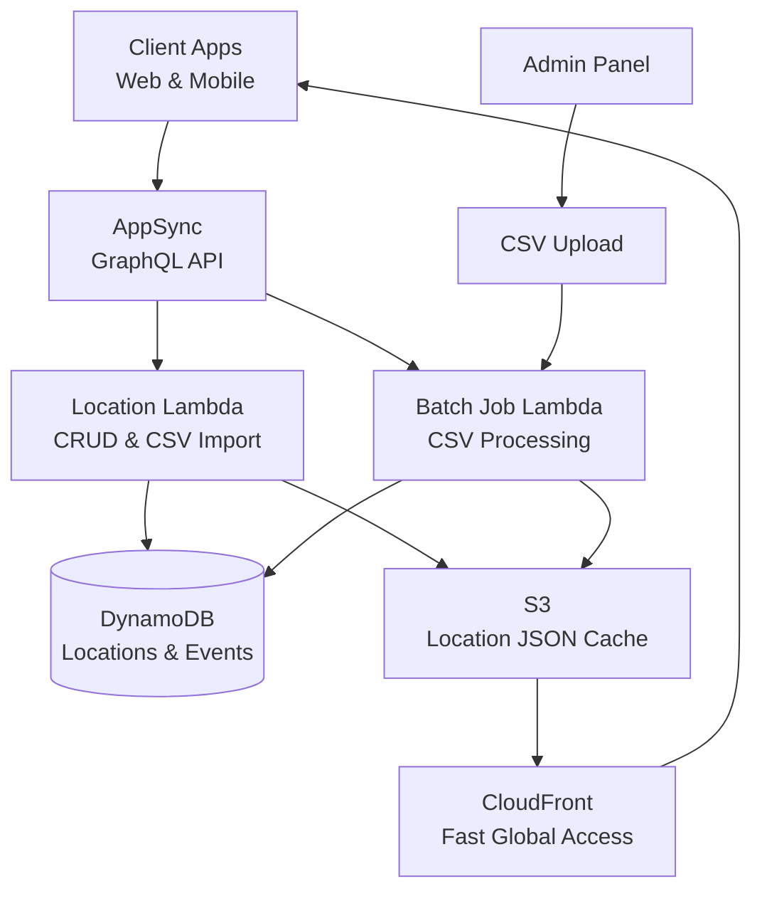

# Location Management System - Lower Level Design

## Overview
The Location Management System provides hierarchical location data (Region → District → Ward → Street) for property addressing and search functionality in the Nest Tanzania Rental Platform.

## System Architecture Diagram



## Location Hierarchy Structure


## CSV Import System

### CSV Format Examples

The CSV import system uses a simple 3-column format: `type`, `name`, and `parent`.

#### Single CSV Format (All Location Types)

| Type | Name | Parent |
|------|------|--------|
| REGION | Dar es Salaam | |
| REGION | Arusha | |
| REGION | Dodoma | |
| REGION | Mwanza | |
| DISTRICT | Ilala | Dar es Salaam |
| DISTRICT | Kinondoni | Dar es Salaam |
| DISTRICT | Temeke | Dar es Salaam |
| DISTRICT | Arusha City | Arusha |
| WARD | Masaki | Kinondoni |
| WARD | Oyster Bay | Kinondoni |
| WARD | Mikocheni | Kinondoni |
| WARD | Kariakoo | Ilala |
| WARD | Upanga West | Ilala |
| WARD | Upanga East | Ilala |
| STREET | Haile Selassie Road | Masaki |
| STREET | Toure Drive | Masaki |
| STREET | Ali Hassan Mwinyi Road | Oyster Bay |
| STREET | Uhuru Street | Kariakoo |
| STREET | India Street | Kariakoo |
| STREET | Samora Avenue | Upanga West |

#### CSV Column Definitions
- **type**: Location type (`REGION`, `DISTRICT`, `WARD`, `STREET`)
- **name**: Location name (must be unique within parent)
- **parent**: Parent location name (empty for regions, required for others)

#### CSV Processing Rules
1. **Hierarchical Order**: Process regions first, then districts, wards, and streets
2. **Parent Resolution**: Parent locations must exist before children
3. **Duplicate Handling**: Locations with same name and parent are updated, not duplicated
4. **Error Handling**: Invalid rows are logged but don't stop the entire import

### CSV Import Flow


## Architecture Components

### AWS Services
- **AWS AppSync**: GraphQL API for location queries and mutations
- **AWS Lambda**: Location data processing, CSV imports, and cache management
- **DynamoDB**: Hierarchical location storage with event sourcing pattern
- **S3**: Location JSON cache for fast client access
- **CloudFront**: Global CDN for location data distribution

### Lambda Functions
- **LocationFunction**: `nest/src/handlers/graphql-location.ts` - CRUD operations and queries
- **BatchJobFunction**: `nest/src/handlers/batch-job.ts` - CSV import processing

### Database Tables
- **locations** (Materialized View): Current location hierarchy state
- **location-events** (Event Store): Immutable location change history

## Data Models

### Location Core Types
```typescript
enum LocationType {
  REGION = 'REGION'
  DISTRICT = 'DISTRICT'
  WARD = 'WARD'
  STREET = 'STREET'
}
```

### Unified Location Model
```typescript
interface Location {
  locationId: ID
  type: LocationType
  name: string
  parentId?: ID
  level: number // 1=Region, 2=District, 3=Ward, 4=Street
  hierarchy: string // "region/district/ward/street"
  code?: string
  metadata?: LocationMetadata
  coordinates?: Coordinates
  createdAt: AWSDateTime
  updatedAt: AWSDateTime
}

interface LocationMetadata {
  population?: number
  area?: number
  postalCode?: string
  economicZone?: string
  administrativeCode?: string
}

interface Coordinates {
  latitude: number
  longitude: number
}
```

### Location Tree Structure (Client Cache)
```typescript
interface LocationTree {
  regions: Region[]
  districts: { [regionId: string]: District[] }
  wards: { [districtId: string]: Ward[] }
  streets: { [wardId: string]: Street[] }
}
```

## API Operations

### Location Hierarchy Queries

#### Get All Regions
```graphql
query GetRegions {
  getRegions {
    id
    name
    code
    population
  }
}
```

#### Get Districts by Region
```graphql
query GetDistricts($regionId: ID!) {
  getDistricts(regionId: $regionId) {
    id
    name
    regionId
    code
    population
  }
}
```

#### Get Wards by District
```graphql
query GetWards($districtId: ID!) {
  getWards(districtId: $districtId) {
    id
    name
    districtId
    code
  }
}
```

#### Get Streets by Ward
```graphql
query GetStreets($wardId: ID!) {
  getStreets(wardId: $wardId) {
    id
    name
    wardId
    postalCode
    coordinates {
      latitude
      longitude
    }
  }
}
```

### Location Management Operations

#### Bulk Import from CSV (Primary Method)
```graphql
mutation ImportLocationsFromCSV($csvData: String!) {
  importLocationsFromCSV(csvData: $csvData) {
    success
    imported
    skipped
    errors
    message
  }
}
```

**CSV Input Format:**
```typescript
interface CSVRow {
  type: 'REGION' | 'DISTRICT' | 'WARD' | 'STREET'
  name: string
  parent?: string // Empty for regions, required for others
}
```

**Implementation Flow:**
1. Parse CSV data with required headers: `type`, `name`, `parent`
2. Validate each row for required fields
3. Process locations in hierarchical order (regions → districts → wards → streets)
4. For each valid row:
   - Resolve parent location by name
   - Generate `LOCATION_CREATED` or `LOCATION_UPDATED` event
   - Materialize location in locations table
5. Update location JSON cache in S3 after batch completion
6. Return detailed import summary with errors

#### Create Single Location (Manual)
```graphql
mutation CreateLocation($input: CreateLocationInput!) {
  createLocation(input: $input) {
    success
    location {
      id
      name
      type
      parentId
    }
    message
  }
}
```

#### Update Location
```graphql
mutation UpdateLocation($locationId: ID!, $input: UpdateLocationInput!) {
  updateLocation(locationId: $locationId, input: $input) {
    success
    message
    location {
      id
      name
      updatedAt
    }
  }
}
```

### Location Cache Management

#### Regenerate Location JSON Cache
```graphql
mutation RegenerateLocationJson {
  regenerateLocationJson {
    success
    cloudfrontUrl
    cacheSize
    message
  }
}
```

**Purpose:** Generates optimized JSON file containing complete location hierarchy for fast client-side access via CDN.
