# Location Management System - Lower Level Design

## Overview
The Location Management System provides hierarchical location data (Region → District → Ward → Street) for property addressing and search functionality in the Nest Tanzania Rental Platform.

## System Architecture Diagram

```mermaid
graph TB
    CLIENT[Client Apps<br/>Web & Mobile<br/>📱 JSON Only] --> CDN[CloudFront CDN<br/>locations.json]
    CDN --> S3[S3 Bucket<br/>Location JSON Cache]
    
    ADMIN[Admin Panel<br/>🔧 GraphQL API] --> APPSYNC[AppSync<br/>GraphQL API]
    APPSYNC --> LOCATION_LAMBDA[Location Lambda<br/>CRUD & CSV Import]
    
    LOCATION_LAMBDA --> DB[(DynamoDB<br/>Locations & Events)]
    LOCATION_LAMBDA --> S3
    
    CSV_UPLOAD[CSV Upload] --> APPSYNC
```



**Key Architecture Points:**
- **Client Apps**: Access location data ONLY via pre-generated JSON from CloudFront CDN
- **Admin Panel**: Uses GraphQL API for location management operations
- **No Direct Database Access**: Clients never query DynamoDB or Lambda functions directly

## Location Hierarchy Structure


## CSV Import System

### CSV Format Examples

The CSV import system uses a simple 3-column format: `type`, `name`, and `parent`.

#### Single CSV Format (All Location Types)

| Type | Name | Parent |
|------|------|--------|
| REGION | Dar es Salaam | |
| REGION | Arusha | |
| REGION | Dodoma | |
| REGION | Mwanza | |
| DISTRICT | Ilala | Dar es Salaam |
| DISTRICT | Kinondoni | Dar es Salaam |
| DISTRICT | Temeke | Dar es Salaam |
| DISTRICT | Arusha City | Arusha |
| WARD | Masaki | Kinondoni |
| WARD | Oyster Bay | Kinondoni |
| WARD | Mikocheni | Kinondoni |
| WARD | Kariakoo | Ilala |
| WARD | Upanga West | Ilala |
| WARD | Upanga East | Ilala |
| STREET | Haile Selassie Road | Masaki |
| STREET | Toure Drive | Masaki |
| STREET | Ali Hassan Mwinyi Road | Oyster Bay |
| STREET | Uhuru Street | Kariakoo |
| STREET | India Street | Kariakoo |
| STREET | Samora Avenue | Upanga West |

#### CSV Column Definitions
- **type**: Location type (`REGION`, `DISTRICT`, `WARD`, `STREET`)
- **name**: Location name (must be unique within parent)
- **parent**: Parent location name (empty for regions, required for others)

#### CSV Processing Rules
1. **Hierarchical Order**: Process regions first, then districts, wards, and streets
2. **Parent Resolution**: Parent locations must exist before children
3. **Duplicate Handling**: Locations with same name and parent are updated, not duplicated
4. **Error Handling**: Invalid rows are logged but don't stop the entire import

### CSV Import Flow


## Architecture Components

### Client Access Pattern
- **Client Apps (Web & Mobile)**: Access location data ONLY via pre-generated JSON file from CloudFront CDN
- **No GraphQL Queries**: Clients never make direct GraphQL calls for location data
- **Static JSON Cache**: Fast, globally distributed location hierarchy via CDN

### Admin Access Pattern
- **Admin Panel**: Uses GraphQL API for location management (CRUD operations, CSV imports)
- **CSV Import**: Bulk location data import through GraphQL mutations
- **Cache Regeneration**: Triggers JSON file regeneration after data changes

### AWS Services
- **CloudFront CDN**: Global distribution of location JSON file for client apps
- **S3**: Static hosting of optimized location JSON cache
- **AWS AppSync**: GraphQL API for admin operations only
- **AWS Lambda**: Location data processing, CSV imports, and JSON generation
- **DynamoDB**: Hierarchical location storage with event sourcing pattern

### Lambda Functions
- **LocationFunction**: `nest/src/handlers/graphql-location.ts` - Admin CRUD operations and JSON generation
- **LocationJsonService**: Generates optimized JSON file for client consumption

### Database Tables
- **locations** (Materialized View): Current location hierarchy state
- **location-events** (Event Store): Immutable location change history

## Data Models

### Location Core Types
```typescript
enum LocationType {
  REGION = 'REGION'
  DISTRICT = 'DISTRICT'
  WARD = 'WARD'
  STREET = 'STREET'
}
```

### Unified Location Model
```typescript
interface Location {
  locationId: ID
  type: LocationType
  name: string
  parentId?: ID
  level: number // 1=Region, 2=District, 3=Ward, 4=Street
  hierarchy: string // "region/district/ward/street"
  code?: string
  metadata?: LocationMetadata
  coordinates?: Coordinates
  createdAt: AWSDateTime
  updatedAt: AWSDateTime
}

interface LocationMetadata {
  population?: number
  area?: number
  postalCode?: string
  economicZone?: string
  administrativeCode?: string
}

interface Coordinates {
  latitude: number
  longitude: number
}
```

## Client Location Access

### Location JSON Structure (Client Consumption)
```typescript
interface LocationsJSON {
  regions: {
    [regionId: string]: {
      id: string
      name: string
      districts: {
        [districtId: string]: {
          id: string
          name: string
          wards: {
            [wardId: string]: {
              id: string
              name: string
              streets: {
                [streetId: string]: {
                  id: string
                  name: string
                }
              }
            }
          }
        }
      }
    }
  }
  lastUpdated: string
  version: number
}
```

### Client Usage Pattern
```typescript
// Client apps fetch location data once on app initialization
const locationsResponse = await fetch('https://cdn.nest.co.tz/locations.json');
const locations: LocationsJSON = await locationsResponse.json();

// Use cached data for all location operations
const regions = Object.values(locations.regions);
const districts = Object.values(locations.regions[regionId].districts);
const wards = Object.values(locations.regions[regionId].districts[districtId].wards);
```

### Benefits of JSON-Only Client Access
- **Ultra-fast loading**: Single HTTP request vs multiple GraphQL queries
- **Offline capability**: JSON can be cached locally for offline use
- **Reduced server load**: No database queries for client location requests
- **Global performance**: CloudFront CDN ensures fast access worldwide
- **Simple client code**: No GraphQL client setup required

## Admin API Operations (GraphQL)

**Note**: These GraphQL operations are for admin use only. Client apps do not use these APIs.

### Location Management Operations

#### Bulk Import from CSV (Primary Method)
```graphql
mutation ImportLocationsFromCSV($csvData: String!) {
  importLocationsFromCSV(csvData: $csvData) {
    success
    imported
    skipped
    errors
    message
  }
}
```

**CSV Input Format:**
```typescript
interface CSVRow {
  type: 'REGION' | 'DISTRICT' | 'WARD' | 'STREET'
  name: string
  parent?: string // Empty for regions, required for others
}
```

**Implementation Flow:**
1. Parse CSV data with required headers: `type`, `name`, `parent`
2. Validate each row for required fields
3. Process locations in hierarchical order (regions → districts → wards → streets)
4. For each valid row:
   - Resolve parent location by name
   - Generate `LOCATION_CREATED` or `LOCATION_UPDATED` event
   - Materialize location in locations table
5. Update location JSON cache in S3 after batch completion
6. Return detailed import summary with errors

#### Create Single Location (Manual)
```graphql
mutation CreateLocation($input: CreateLocationInput!) {
  createLocation(input: $input) {
    success
    location {
      id
      name
      type
      parentId
    }
    message
  }
}
```

#### Update Location
```graphql
mutation UpdateLocation($locationId: ID!, $input: UpdateLocationInput!) {
  updateLocation(locationId: $locationId, input: $input) {
    success
    message
    location {
      id
      name
      updatedAt
    }
  }
}
```

#### Regenerate Location JSON Cache (Critical Operation)
```graphql
mutation RegenerateLocationJson {
  regenerateLocationJson {
    success
    cloudfrontUrl
    cacheSize
    message
  }
}
```

**Purpose**: Generates optimized JSON file containing complete location hierarchy for client consumption via CDN.

**When to Use**:
- After CSV imports
- After manual location updates
- When location data becomes inconsistent
- Scheduled maintenance updates

**Process**:
1. Query all locations from DynamoDB
2. Build hierarchical JSON structure
3. Upload to S3 with public read access
4. Invalidate CloudFront cache
5. Return CDN URL for verification
