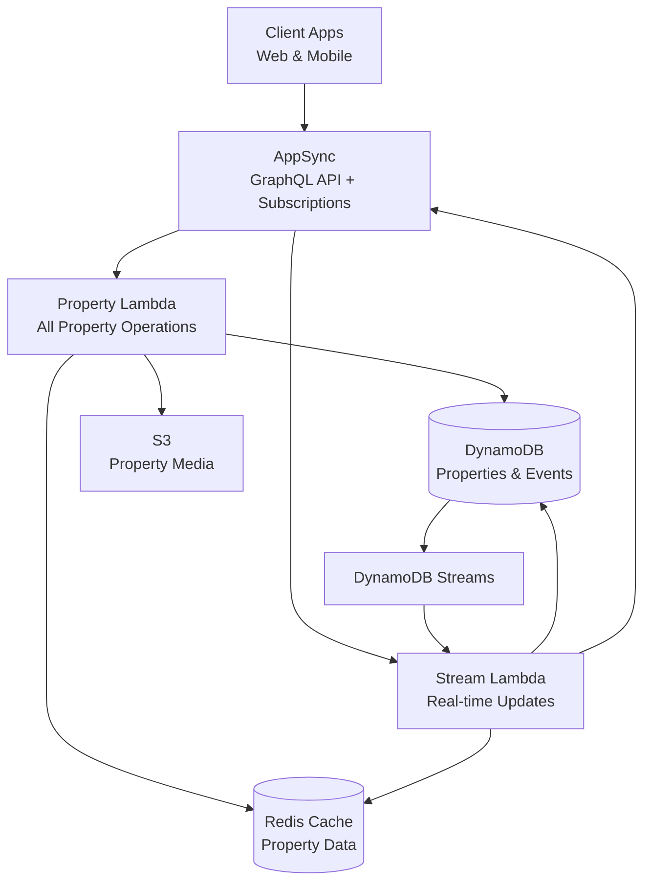
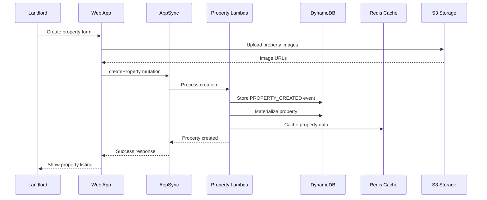
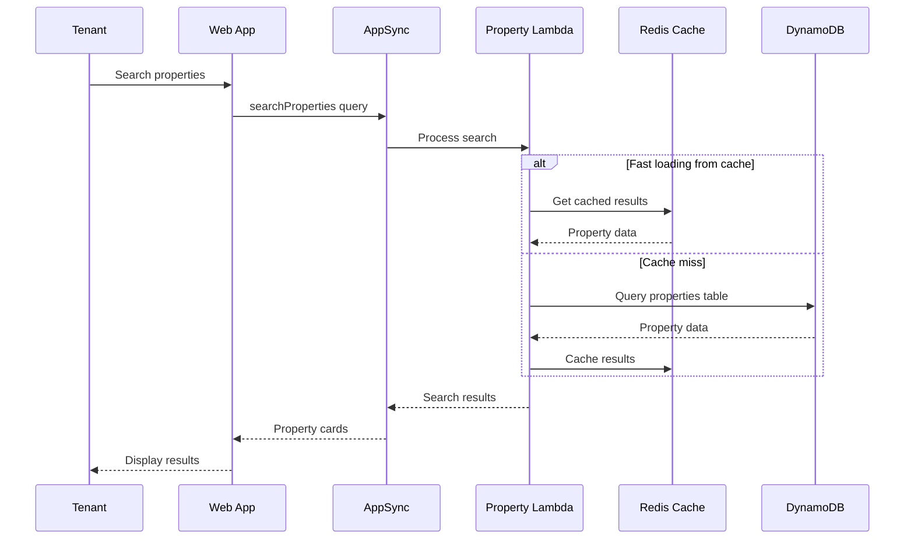
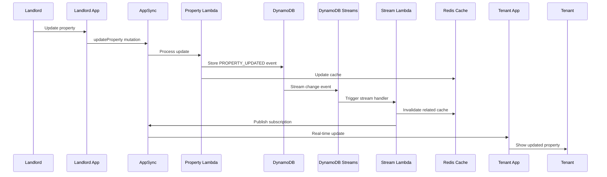

# Property Management System - Lower Level Design

## Overview
The Property Management System handles property listings, search, discovery, favorites, and media management for the Nest Tanzania Rental Platform.

## System Architecture Diagram



## Architecture Components

### AWS Services
- **AWS AppSync**: GraphQL API with real-time subscriptions
- **AWS Lambda**: Business logic processing
- **DynamoDB**: Data persistence with event sourcing
- **DynamoDB Streams**: Real-time change notifications
- **Redis Cache**: High-performance property data caching
- **S3 + CloudFront**: Media storage and delivery
- **OpenSearch**: Advanced search capabilities (future enhancement)

### Lambda Functions
- **PropertyFunction**: `nest/src/handlers/graphql-property.ts`
  - Handles: CRUD operations, search, favorites, views, Redis caching
- **PropertyStreamFunction**: `nest/src/handlers/property-stream.ts`
  - Handles: Real-time subscription events from DynamoDB Streams, cache invalidation

### Database Tables
- **properties** (Materialized View): Current property state
- **property-events** (Event Store): Immutable property event history
- **user-activity**: Property views, favorites, and interactions
- **media-library**: Property media files and metadata

## Data Models

### Property Core Types
```typescript
enum PropertyType {
  APARTMENT = 'APARTMENT'
  HOUSE = 'HOUSE'
  STUDIO = 'STUDIO'
  ROOM = 'ROOM'
  COMMERCIAL = 'COMMERCIAL'
  LAND = 'LAND'
}

enum PropertyStatus {
  DRAFT = 'DRAFT'
  AVAILABLE = 'AVAILABLE'
  RENTED = 'RENTED'
  MAINTENANCE = 'MAINTENANCE'
  DELETED = 'DELETED'
}
```

### Property Data Model
```typescript
interface Property {
  propertyId: ID
  landlordId: ID
  managerId?: ID
  title: string
  description: string
  address: Address
  propertyType: PropertyType
  specifications: PropertySpecifications
  pricing: PropertyPricing
  amenities: string[]
  media?: PropertyMedia
  availability: PropertyAvailability
  status: PropertyStatus
  version: number
  viewCount?: number
  favoriteCount?: number
  createdAt: AWSDateTime
  updatedAt: AWSDateTime
}

interface Address {
  street: string
  ward: string
  district: string
  region: string
  postalCode?: string
  coordinates?: Coordinates
}

interface Coordinates {
  latitude: number
  longitude: number
}

interface PropertySpecifications {
  squareMeters: number
  bedrooms?: number
  bathrooms?: number
  floors?: number
  parkingSpaces?: number
  furnished: boolean
}

interface PropertyPricing {
  monthlyRent: number
  deposit: number
  currency: string
  utilitiesIncluded: boolean
  serviceCharge?: number
}

interface PropertyMedia {
  images?: string[]
  videos?: string[]
  virtualTour?: string
  floorPlan?: string
}

interface PropertyAvailability {
  available: boolean
  availableFrom?: AWSDateTime
  minimumLeaseTerm?: number
  maximumLeaseTerm?: number
}
```

### Property Card (Optimized for Lists)
```typescript
interface PropertyCard {
  propertyId: ID
  title: string
  monthlyRent: number
  currency: string
  propertyType: PropertyType
  bedrooms?: number
  district: string
  region: string
  thumbnail?: string
  available: boolean
  viewCount?: number
  favoriteCount?: number
}
```

## API Operations

### Property Listing Management

#### Create Property
```graphql
mutation CreateProperty($landlordId: ID!, $input: CreatePropertyInput!) {
  createProperty(landlordId: $landlordId, input: $input) {
    propertyId
    title
    status
    createdAt
  }
}
```

**Input:**
```typescript
interface CreatePropertyInput {
  title: string
  description: string
  address: AddressInput
  propertyType: PropertyType
  specifications: PropertySpecificationsInput
  pricing: PropertyPricingInput
  amenities: string[]
  media?: PropertyMediaInput
  availability: PropertyAvailabilityInput
}
```

**Implementation Flow:**
1. Validate landlord permissions
2. Validate input data and location
3. Generate property event: `PROPERTY_CREATED`
4. Materialize property in properties table
5. Cache property data in Redis
6. Publish subscription event
7. Return property details

#### Update Property
```graphql
mutation UpdateProperty($propertyId: ID!, $landlordId: ID!, $input: UpdatePropertyInput!) {
  updateProperty(propertyId: $propertyId, landlordId: $landlordId, input: $input) {
    propertyId
    title
    updatedAt
    version
  }
}
```

**Implementation Flow:**
1. Validate ownership permissions
2. Compare changes with current state
3. Generate property events for each change
4. Materialize updates
5. Update Redis cache
6. Publish subscription events
7. Update search index (if applicable)


### Property Discovery & Search

#### Get Property Cards (Browse)
```graphql
query GetPropertyCards($limit: Int, $nextToken: String) {
  getPropertyCards(limit: $limit, nextToken: $nextToken) {
    properties {
      propertyId
      title
      monthlyRent
      currency
      propertyType
      bedrooms
      district
      region
      thumbnail
      available
    }
    nextToken
    count
  }
}
```

#### Get Property Details
```graphql
query GetProperty($propertyId: ID!) {
  getProperty(propertyId: $propertyId) {
    propertyId
    title
    description
    address {
      street
      ward
      district
      region
      coordinates {
        latitude
        longitude
      }
    }
    specifications {
      squareMeters
      bedrooms
      bathrooms
      furnished
    }
    pricing {
      monthlyRent
      deposit
      currency
      utilitiesIncluded
    }
    amenities
    media {
      images
      videos
      virtualTour
      floorPlan
    }
    availability {
      available
      availableFrom
      minimumLeaseTerm
    }
    status
    viewCount
  }
}
```

#### Location-Based Queries
```graphql
query GetPropertiesByLocation($region: String!, $district: String!) {
  getPropertiesByLocation(region: $region, district: $district) {
    propertyId
    title
    monthlyRent
    propertyType
    thumbnail
  }
}

query GetNearbyProperties($lat: Float!, $lng: Float!, $radiusKm: Float) {
  getNearbyProperties(lat: $lat, lng: $lng, radiusKm: $radiusKm) {
    propertyId
    title
    monthlyRent
    address {
      district
      coordinates {
        latitude
        longitude
      }
    }
  }
}
```

### Property Favorites & Activity

#### Add to Favorites
```graphql
mutation AddToFavorites($userId: ID!, $propertyId: ID!) {
  addToFavorites(userId: $userId, propertyId: $propertyId) {
    success
    message
  }
}
```

#### Track Property View
```graphql
mutation TrackPropertyView($userId: ID!, $propertyId: ID!) {
  trackPropertyView(userId: $userId, propertyId: $propertyId) {
    success
    viewCount
  }
}
```

### Real-time Subscriptions

#### Property Updates
```graphql
subscription OnPropertyUpdated($propertyId: ID!) {
  onPropertyUpdated(propertyId: $propertyId) {
    propertyId
    eventType
    property {
      title
      pricing {
        monthlyRent
      }
      status
    }
    changes {
      field
      oldValue
      newValue
    }
    timestamp
  }
}
```

#### New Properties in Region
```graphql
subscription OnNewPropertyInRegion($region: String!) {
  onNewPropertyInRegion(region: $region) {
    propertyId
    title
    monthlyRent
    district
    thumbnail
  }
}
```

## Property Flow Diagrams

### Property Creation Flow



### Property Search Flow



### Real-time Property Updates Flow

