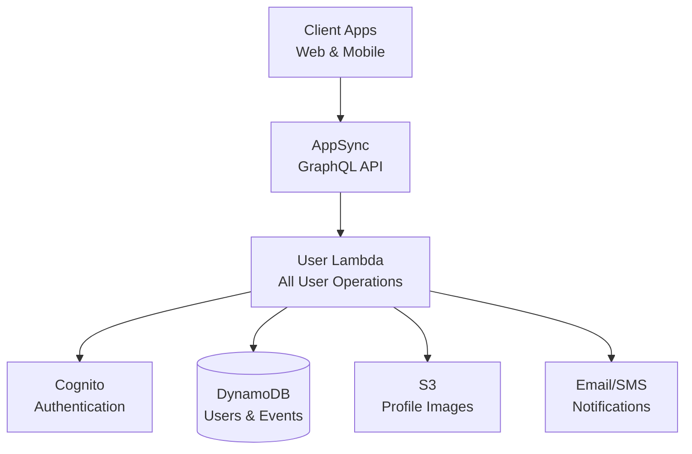
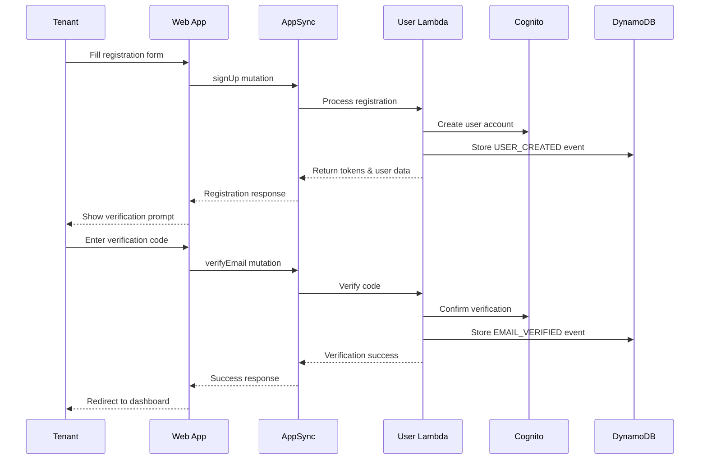
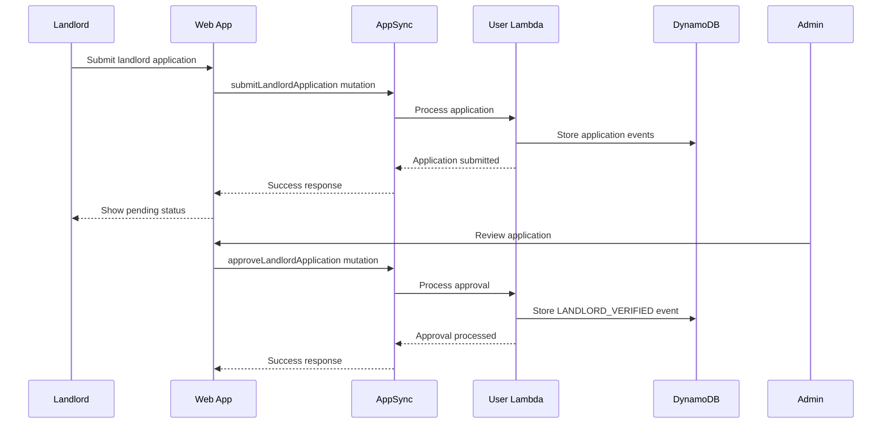

# User Management System - Lower Level Design

## Overview
The User Management System handles authentication, authorization, and user profile management for Tenants, Landlords, and Admins in the Nest Tanzania Rental Platform.

## System Architecture Diagram



## Architecture Components

### AWS Services
- **AWS Cognito User Pool**: Authentication and user management
- **AWS AppSync**: GraphQL API gateway
- **AWS Lambda**: Business logic processing
- **DynamoDB**: Data persistence with event sourcing
- **S3 + CloudFront**: Profile image storage

### Lambda Functions
- **UserFunction**: `nest/src/handlers/graphql-auth.ts`
- **Handler**: `rental-auth-{stage}`
- **Handles**: Authentication, profile management, and landlord verification
- **Timeout**: 30 seconds
- **Memory**: 128MB (default)

### Database Tables
- **users** (Materialized View): Current user state
- **user-events** (Event Store): Immutable user event history
- **user-activity**: Property views, favorites, and interactions
- **application-events**: Landlord verification applications

## Data Models

### User Profile Types
```typescript
enum UserType {
  TENANT = 'TENANT'
  LANDLORD = 'LANDLORD'
  ADMIN = 'ADMIN'
}

enum AccountStatus {
  PENDING_VERIFICATION = 'PENDING_VERIFICATION'
  ACTIVE = 'ACTIVE'
  SUSPENDED = 'SUSPENDED'
  PENDING_LANDLORD_VERIFICATION = 'PENDING_LANDLORD_VERIFICATION'
}
```

### Base User Profile
```typescript
interface BaseUser {
  userId: ID
  email: string
  phoneNumber: string
  firstName: string
  lastName: string
  userType: UserType
  accountStatus: AccountStatus
  isEmailVerified: boolean
  profileImage?: string
  language: string
  currency: string
  emailNotifications: boolean
  smsNotifications: boolean
  pushNotifications: boolean
  createdAt: AWSDateTime
  updatedAt: AWSDateTime
}
```

### Tenant Profile
```typescript
interface Tenant extends BaseUser {
  userType: 'TENANT'
  preferences?: {
    maxBudget?: number
    preferredLocations?: string[]
    propertyTypes?: PropertyType[]
    amenities?: string[]
  }
  viewedProperties?: string[]
  favoriteProperties?: string[]
  applicationHistory?: string[]
}
```

### Landlord Profile
```typescript
interface Landlord extends BaseUser {
  userType: 'LANDLORD'
  verificationDocuments?: string[]
  nationalId?: string
  birthDate?: string
  alternatePhone?: string
  address?: Address
  verificationStatus?: 'PENDING' | 'APPROVED' | 'REJECTED'
}
```

### Admin Profile
```typescript
interface Admin extends BaseUser {
  userType: 'ADMIN'
  permissions: string[]
  adminLevel?: 'SUPER_ADMIN' | 'MODERATOR' | 'SUPPORT'
}
```

## API Operations

### Property Activity Operations

#### Add to Favorites
```graphql
mutation AddToFavorites($userId: ID!, $propertyId: ID!) {
  addToFavorites(userId: $userId, propertyId: $propertyId) {
    success
    message
  }
}
```

#### Remove from Favorites
```graphql
mutation RemoveFromFavorites($userId: ID!, $propertyId: ID!) {
  removeFromFavorites(userId: $userId, propertyId: $propertyId) {
    success
    message
  }
}
```

#### Get User Favorites
```graphql
query GetUserFavorites($userId: ID!) {
  getUserFavorites(userId: $userId) {
    propertyId
    title
    monthlyRent
    district
    thumbnail
    addedAt
  }
}
```

#### Get User Viewed Properties
```graphql
query GetUserViewedProperties($userId: ID!) {
  getUserViewedProperties(userId: $userId) {
    propertyId
    title
    monthlyRent
    district
    thumbnail
    viewedAt
  }
}
```

**Implementation Flow for Property View:**
1. User calls `getProperty` query
2. System automatically tracks view in user-activity table
3. Updates user's viewedProperties list
4. Increments property view count


## User Flow Diagrams

### Tenant Registration Flow



### Landlord Verification Flow

