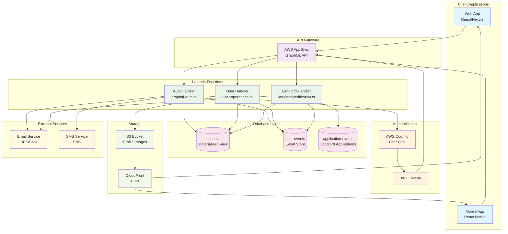
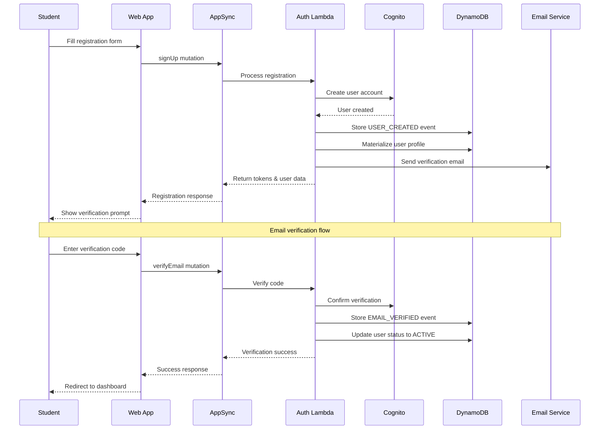
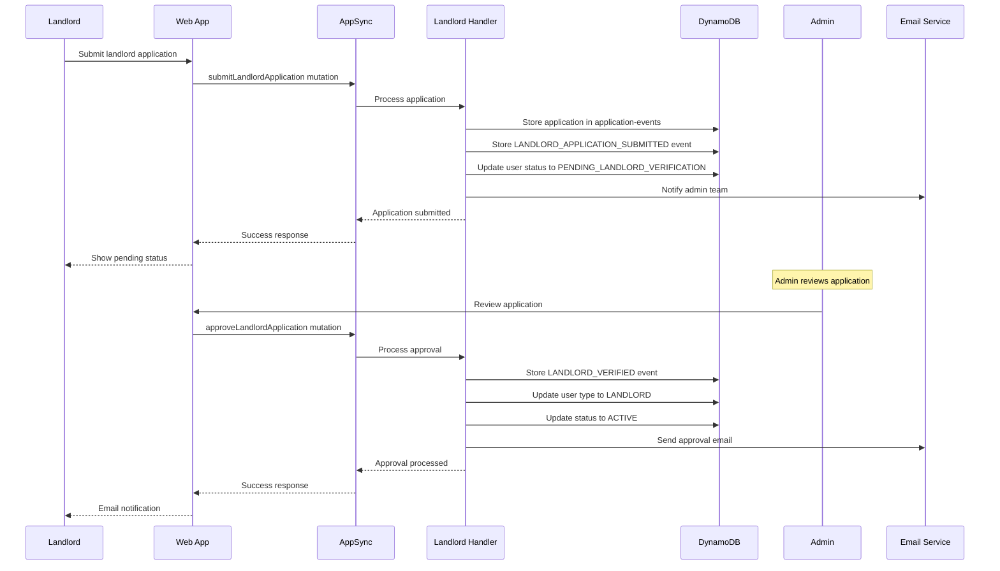
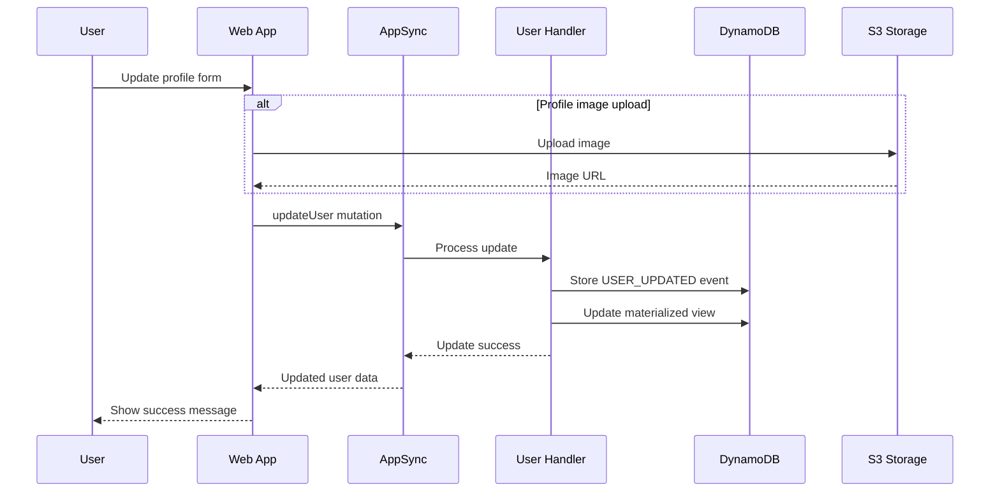

# User Management System - Lower Level Design

## Overview
The User Management System handles authentication, authorization, and user profile management for Students, Landlords, and Admins in the Nest Tanzania Rental Platform.

## System Architecture Diagram



## User Flow Diagrams

### Student Registration Flow



### Landlord Verification Flow



### User Profile Update Flow



## Architecture Components

### AWS Services
- **AWS Cognito User Pool**: Authentication and user management
- **AWS AppSync**: GraphQL API gateway
- **AWS Lambda**: Business logic processing
- **DynamoDB**: Data persistence with event sourcing
- **S3 + CloudFront**: Profile image storage

### Lambda Functions
- **AuthFunction**: `nest/src/handlers/graphql-auth.ts`
- **Handler**: `rental-auth-{stage}`
- **Timeout**: 30 seconds
- **Memory**: 128MB (default)

### Database Tables
- **users** (Materialized View): Current user state
- **user-events** (Event Store): Immutable user event history
- **application-events**: Landlord verification applications

## Data Models

### User Profile Types
```typescript
enum UserType {
  TENANT = 'TENANT'
  LANDLORD = 'LANDLORD'
  ADMIN = 'ADMIN'
}

enum AccountStatus {
  PENDING_VERIFICATION = 'PENDING_VERIFICATION'
  ACTIVE = 'ACTIVE'
  SUSPENDED = 'SUSPENDED'
  PENDING_LANDLORD_VERIFICATION = 'PENDING_LANDLORD_VERIFICATION'
}
```

### Base User Profile
```typescript
interface BaseUser {
  userId: ID
  email: string
  phoneNumber: string
  firstName: string
  lastName: string
  userType: UserType
  accountStatus: AccountStatus
  isEmailVerified: boolean
  profileImage?: string
  language: string
  currency: string
  emailNotifications: boolean
  smsNotifications: boolean
  pushNotifications: boolean
  createdAt: AWSDateTime
  updatedAt: AWSDateTime
}
```

### Student (Tenant) Profile
```typescript
interface Tenant extends BaseUser {
  userType: 'TENANT'
  preferences?: {
    maxBudget?: number
    preferredLocations?: string[]
    propertyTypes?: PropertyType[]
    amenities?: string[]
  }
  savedProperties?: string[]
  applicationHistory?: string[]
}
```

### Landlord Profile
```typescript
interface Landlord extends BaseUser {
  userType: 'LANDLORD'
  businessName?: string
  businessLicense?: string
  taxId?: string
  verificationDocuments?: string[]
  nationalId?: string
  birthDate?: string
  alternatePhone?: string
  address?: Address
  propertiesOwned?: string[]
  verificationStatus?: 'PENDING' | 'APPROVED' | 'REJECTED'
}
```

### Admin Profile
```typescript
interface Admin extends BaseUser {
  userType: 'ADMIN'
  permissions: string[]
  adminLevel?: 'SUPER_ADMIN' | 'MODERATOR' | 'SUPPORT'
}
```

## API Operations

### Authentication Operations

#### Student Registration
```graphql
mutation SignUp($input: SignUpInput!) {
  signUp(input: $input) {
    accessToken
    refreshToken
    user {
      userId
      firstName
      lastName
      email
      userType
      accountStatus
    }
  }
}
```

**Input:**
```typescript
interface SignUpInput {
  email: string
  password: string
  phoneNumber: string
  firstName: string
  lastName: string
}
```

**Implementation Flow:**
1. Validate input data
2. Create Cognito user account
3. Generate user event: `USER_CREATED`
4. Materialize user profile in users table
5. Send email verification
6. Return JWT tokens

#### Email Verification
```graphql
mutation VerifyEmail($email: String!, $code: String!) {
  verifyEmail(email: $email, code: $code) {
    success
    message
  }
}
```

**Implementation Flow:**
1. Verify code with Cognito
2. Generate user event: `EMAIL_VERIFIED`
3. Update user status to ACTIVE
4. Return success response

#### Sign In
```graphql
mutation SignIn($email: String!, $password: String!) {
  signIn(email: $email, password: $password) {
    accessToken
    refreshToken
    user {
      userId
      firstName
      lastName
      email
      userType
      accountStatus
    }
  }
}
```

**Implementation Flow:**
1. Authenticate with Cognito
2. Retrieve user profile from users table
3. Update last login timestamp
4. Return JWT tokens and user data

### Profile Management Operations

#### Update User Profile
```graphql
mutation UpdateUser($userId: ID!, $input: UpdateUserInput!) {
  updateUser(userId: $userId, input: $input) {
    ... on Tenant {
      userId
      firstName
      lastName
      preferences
    }
    ... on Landlord {
      userId
      firstName
      lastName
      businessName
    }
  }
}
```

**Input:**
```typescript
interface UpdateUserInput {
  firstName?: string
  lastName?: string
  phoneNumber?: string
  profileImage?: string
  preferences?: AWSJSON
}
```

#### Get User Profile
```graphql
query GetUser($userId: ID!) {
  getUser(userId: $userId) {
    ... on Tenant {
      userId
      firstName
      lastName
      email
      preferences
      savedProperties
    }
    ... on Landlord {
      userId
      firstName
      lastName
      businessName
      verificationStatus
    }
  }
}
```

### Landlord Verification Operations

#### Submit Landlord Application
```graphql
mutation SubmitLandlordApplication($input: LandlordApplicationInput!) {
  submitLandlordApplication(input: $input) {
    success
    message
    applicationId
    status
    submittedAt
  }
}
```

**Input:**
```typescript
interface LandlordApplicationInput {
  userId: ID
  nationalId: string
  birthDate: string
  phoneNumber: string
  alternatePhone?: string
  address: AddressInput
}
```